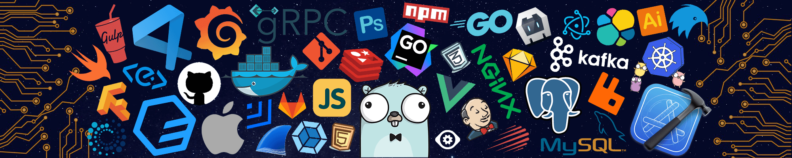

<h1 align="center">Hello,World</h1>

  

  

  

 

## About Me

I'm a programmer focused on learning, building projects and understanding how technology works.

I started programming to improve my problem-solving skills and create real-world solutions. Over time, I started working with **JavaScript**, **TypeScript**, **Python** and **C++**, while also exploring **HTML**, **CSS** and **SQL**.

My first backend experience was built with **Node.js** and **Supabase**, which helped me understand backend development, databases and how applications communicate with their services.

I've also worked with technologies such as **React**, **Next.js**, **NestJS**, **.NET**, **Docker**, **Firebase** and **Electron**, while using tools and technologies such as **Git**, **Linux**, **Figma**, **Tailwind CSS** and **Framer** in different projects.

I'm currently studying **C++** and heading towards **Cyber Security**, with a growing interest in **backend development, databases, Linux, networking, systems programming, operating systems and low-level technologies**.

I enjoy learning through practical projects, experimenting with different technologies and constantly improving my programming skills.

 

<h3 align="left">Connect with Me:</h3>

  
  

<h3 align="left">Programming Languages:</h3>

  

<h3 align="left">Frontend:</h3>

  

<h3 align="left">Backend:</h3>

  

<h3 align="left">Databases:</h3>

  

<h3 align="left">Tools &amp; Infrastructure:</h3>

  

 

## Projects

<table>
<tr>
<td width="50%">

### [Pd-jammer](https://github.com/pedro12345lisboa-sudo/Pd-jammer)

`Python` `C++`

A hardware-first library to document, model and validate jumper wire plans for the DOIT ESP32 DevKit V1, with shared Python and C++ front-ends, a CLI and explicit pin, power and logic-level rules.

</td>

<td width="50%">

### [ddos-pt-br](https://github.com/pedro12345lisboa-sudo/ddos-pt-br)

`Python`

An async HTTP stress testing tool for authorized resilience testing of web infrastructure, built with `asyncio` and `aiohttp`.

</td>
</tr>
</table>

 

## GitHub

 

 

 

 

  

 

  

 

──── <strong>Focus · Code · Growth</strong> /> ────

